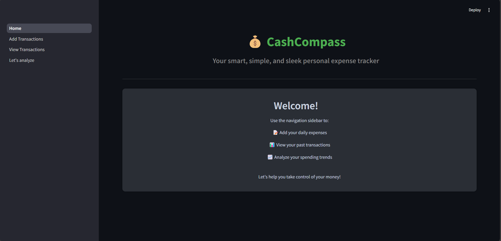
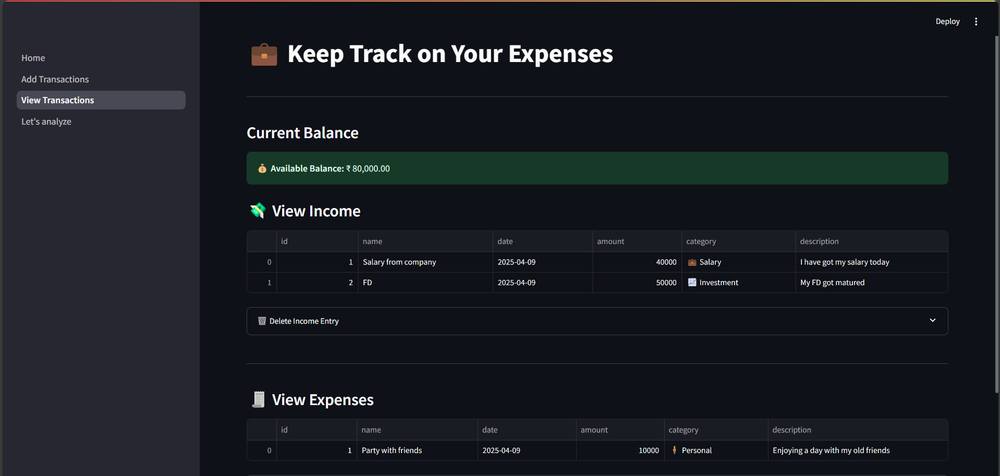
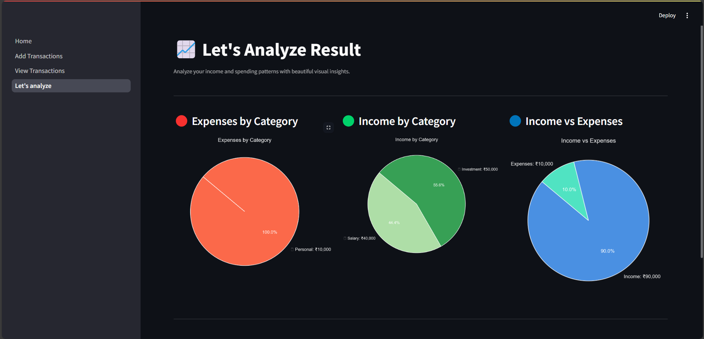

# 💰 Personal Expense Tracker (Streamlit + Python)

A simple yet powerful expense tracker built using Python and Streamlit. Visualize your income and expenses with intuitive graphs, pie charts, and data summaries. This app helps you manage your finances, set goals, and track your spending habits over time.

---

## 🚀 Features

- 📊 Income and expense tracking
- 📅 Date-wise, category-wise entries
- 📈 Data visualization using Matplotlib and Seaborn
- 🧠 Powered by `pandas` for data handling
- 🎯 Simple UI using Streamlit

---

## 🛠️ Technologies Used

- Python 3.x
- Streamlit
- Pandas
- Matplotlib
- Seaborn

---

## Preview

